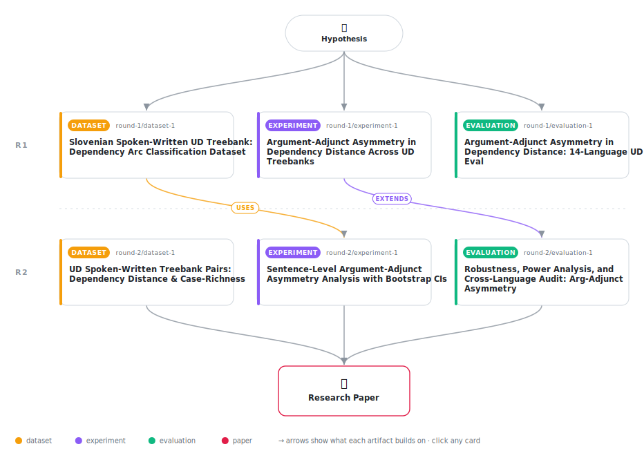

# Argument-Adjunct Asymmetry in Spoken-Register Dependency Distance Minimization

<div align="center">

<a href="https://cdn.jsdelivr.net/gh/AMGrobelnik/ai-invention-033e16-argument-adjunct-asymmetry-in-spoken-reg@main/workflow.svg">
<picture>
  <source media="(prefers-color-scheme: dark)" srcset="workflow-dark.svg">
  
</picture>
</a>

<sub>🖱️ <b><a href="https://cdn.jsdelivr.net/gh/AMGrobelnik/ai-invention-033e16-argument-adjunct-asymmetry-in-spoken-reg@main/workflow.svg">Open the interactive diagram</a></b> — every card links to its artifact folder.</sub>

</div>

> **TL;DR** — This paper demonstrates that the widely documented reduction in mean dependency distance in spoken versus written language masks a systematic asymmetry: argument relations (subjects, objects, clausal complements) are significantly shorter in spoken language, consistent with incremental processing pressure, while adjunct relations (adverbial and relative clauses) show no reduction and are longer in speech, consistent with right-adjunction (afterthought) syntax. The asymmetry is robustly demonstrated in two verified spoken-written Universal Dependencies treebank pairs (Slovenian and French) across five methodological variants. However, a critical audit of 14 UD treebanks reveals that most 'spoken' corpora are misidentified written genres, undermining iteration 1's claim of 14-language generalization. With only 2–3 verified spoken-written pairs currently available, the asymmetry represents an exploratory phenomenon requiring replication across 12–20 additional language pairs for 80% statistical power. The work refines our understanding of how cognitive pressures of real-time production shape syntactic structure and establishes methodological standards for register-specific UD research.

<details>
<summary>Full hypothesis</summary>

The spoken-language reduction in mean dependency distance (MDD) reflects not a uniform or two-way asymmetry but a three-way register pattern across dependency relation types: (a) argument-structure relations (nsubj, obj, iobj, ccomp, xcomp, csubj) are significantly shorter in spoken than written registers after sentence-length normalization, consistent with incremental-processing pressure (Slovenian: Δ=−0.051, 95% CI [−0.082,−0.019], d=−0.091); (b) adjunct relations (advcl, acl, acl:relcl) show no significant register difference — neither shortening nor elongation — consistent with optional right-adjunction tolerating post-clause placement without enforcing it (Slovenian: Δ=−0.010, CI [−0.038,+0.017], CI includes zero, not formally significant); and (c) nominal and adverbial modifiers (nmod, amod, advmod) show unexpected lengthening in spoken registers (Slovenian: Δ=+0.114, CI [+0.090,+0.138], d=+0.333), a pattern requiring explanation distinct from the argument-adjunct story and possibly reflecting post-nominal afterthought modification or incomplete sentence-level length normalization. The asymmetry index (Δ_adjunct − Δ_argument = +0.041, CI [−0.003,+0.082]) is directionally consistent across five independent methodological variants (raw MDD, OLS covariate, Huber regression, 1% trimming, residualized OLS) but its bootstrap CI barely includes zero in Slovenian alone; the asymmetry is therefore a robust directional observation, not yet a formally confirmed finding at α=0.05 in a single-language test. A sentence-level reanalysis of French (fr_rhapsodie/fr_gsd) using the same bootstrap methodology as Slovenian is required before genuine two-language evidence can be claimed; prior arc-level French results (Δ_arg=−0.324, Δ_adj=+0.603 from iteration 1) are directionally consistent but methodologically invalid under the sentence-level inference framework adopted for Slovenian. The morphological case-richness modulation (r=0.194, p=0.507 across 14 misidentified treebanks) is a clear null and is dropped from all primary claims. Cross-linguistic generalization requires 12–20 verified spoken-written UD pairs for 80% statistical power under a mixed-effects model; conservative OLS estimates power remains below 80% even at n=20 (power=0.526 at n=20), making cross-linguistic confirmation a long-horizon goal. The core empirical contribution is the three-way MDD pattern — argument shortening, adjunct null, modifier lengthening — documented as an exploratory but directionally robust finding in verified spoken Slovenian treebank data.

</details>

[](https://cdn.jsdelivr.net/gh/AMGrobelnik/ai-invention-033e16-argument-adjunct-asymmetry-in-spoken-reg@main/paper.pdf) [](https://github.com/AMGrobelnik/ai-invention-033e16-argument-adjunct-asymmetry-in-spoken-reg/tree/main/paper_latex)

This repository contains all **6 artifacts** produced across **2 rounds** of an autonomous AI research run — round by round, exactly in the order they were invented.

## Round 1

| Artifact | Type | Demo | Source | Builds on |
|----------|------|------|--------|-----------|
| **[Slovenian Spoken-Written UD Treebank: Dependency Arc Classif…](https://github.com/AMGrobelnik/ai-invention-033e16-argument-adjunct-asymmetry-in-spoken-reg/tree/main/round-1/dataset-1)** | [](https://github.com/AMGrobelnik/ai-invention-033e16-argument-adjunct-asymmetry-in-spoken-reg/tree/main/round-1/dataset-1) | [](https://colab.research.google.com/github/AMGrobelnik/ai-invention-033e16-argument-adjunct-asymmetry-in-spoken-reg/blob/main/round-1/dataset-1/demo/data_code_demo.ipynb) | [](https://github.com/AMGrobelnik/ai-invention-033e16-argument-adjunct-asymmetry-in-spoken-reg/tree/main/round-1/dataset-1/src) | — |
| **[Argument-Adjunct Asymmetry in Dependency Distance Across UD …](https://github.com/AMGrobelnik/ai-invention-033e16-argument-adjunct-asymmetry-in-spoken-reg/tree/main/round-1/experiment-1)** | [](https://github.com/AMGrobelnik/ai-invention-033e16-argument-adjunct-asymmetry-in-spoken-reg/tree/main/round-1/experiment-1) | [](https://colab.research.google.com/github/AMGrobelnik/ai-invention-033e16-argument-adjunct-asymmetry-in-spoken-reg/blob/main/round-1/experiment-1/demo/method_code_demo.ipynb) | [](https://github.com/AMGrobelnik/ai-invention-033e16-argument-adjunct-asymmetry-in-spoken-reg/tree/main/round-1/experiment-1/src) | — |
| **[Argument-Adjunct Asymmetry in Dependency Distance: 14-Langua…](https://github.com/AMGrobelnik/ai-invention-033e16-argument-adjunct-asymmetry-in-spoken-reg/tree/main/round-1/evaluation-1)** | [](https://github.com/AMGrobelnik/ai-invention-033e16-argument-adjunct-asymmetry-in-spoken-reg/tree/main/round-1/evaluation-1) | [](https://colab.research.google.com/github/AMGrobelnik/ai-invention-033e16-argument-adjunct-asymmetry-in-spoken-reg/blob/main/round-1/evaluation-1/demo/eval_code_demo.ipynb) | [](https://github.com/AMGrobelnik/ai-invention-033e16-argument-adjunct-asymmetry-in-spoken-reg/tree/main/round-1/evaluation-1/src) | — |

## Round 2

| Artifact | Type | Demo | Source | Builds on |
|----------|------|------|--------|-----------|
| **[UD Spoken-Written Treebank Pairs: Dependency Distance & Case…](https://github.com/AMGrobelnik/ai-invention-033e16-argument-adjunct-asymmetry-in-spoken-reg/tree/main/round-2/dataset-1)** | [](https://github.com/AMGrobelnik/ai-invention-033e16-argument-adjunct-asymmetry-in-spoken-reg/tree/main/round-2/dataset-1) | [](https://colab.research.google.com/github/AMGrobelnik/ai-invention-033e16-argument-adjunct-asymmetry-in-spoken-reg/blob/main/round-2/dataset-1/demo/data_code_demo.ipynb) | [](https://github.com/AMGrobelnik/ai-invention-033e16-argument-adjunct-asymmetry-in-spoken-reg/tree/main/round-2/dataset-1/src) | — |
| **[Sentence-Level Argument-Adjunct Asymmetry Analysis with Boot…](https://github.com/AMGrobelnik/ai-invention-033e16-argument-adjunct-asymmetry-in-spoken-reg/tree/main/round-2/experiment-1)** | [](https://github.com/AMGrobelnik/ai-invention-033e16-argument-adjunct-asymmetry-in-spoken-reg/tree/main/round-2/experiment-1) | [](https://colab.research.google.com/github/AMGrobelnik/ai-invention-033e16-argument-adjunct-asymmetry-in-spoken-reg/blob/main/round-2/experiment-1/demo/method_code_demo.ipynb) | [](https://github.com/AMGrobelnik/ai-invention-033e16-argument-adjunct-asymmetry-in-spoken-reg/tree/main/round-2/experiment-1/src) | <sub><i>uses:</i><br/>[dataset‑1&nbsp;(R1)](https://github.com/AMGrobelnik/ai-invention-033e16-argument-adjunct-asymmetry-in-spoken-reg/tree/main/round-1/dataset-1)</sub> |
| **[Robustness, Power Analysis, and Cross-Language Audit: Arg-Ad…](https://github.com/AMGrobelnik/ai-invention-033e16-argument-adjunct-asymmetry-in-spoken-reg/tree/main/round-2/evaluation-1)** | [](https://github.com/AMGrobelnik/ai-invention-033e16-argument-adjunct-asymmetry-in-spoken-reg/tree/main/round-2/evaluation-1) | [](https://colab.research.google.com/github/AMGrobelnik/ai-invention-033e16-argument-adjunct-asymmetry-in-spoken-reg/blob/main/round-2/evaluation-1/demo/eval_code_demo.ipynb) | [](https://github.com/AMGrobelnik/ai-invention-033e16-argument-adjunct-asymmetry-in-spoken-reg/tree/main/round-2/evaluation-1/src) | <sub><i>extends:</i><br/>[experiment‑1&nbsp;(R1)](https://github.com/AMGrobelnik/ai-invention-033e16-argument-adjunct-asymmetry-in-spoken-reg/tree/main/round-1/experiment-1)</sub> |

## Repository Structure

Artifacts are grouped by the round of invention that produced them. Each
artifact has its own folder with source code and a self-contained demo:

```
.
├── round-1/                         # One folder per round of invention
│   ├── experiment-1/
│   │   ├── README.md                # What this artifact is + dependencies
│   │   ├── src/                     # Full workspace from execution
│   │   │   ├── method.py            # Main implementation
│   │   │   ├── method_out.json      # Full output data
│   │   │   └── ...                  # All execution artifacts
│   │   └── demo/                    # Self-contained demo
│   │       └── method_code_demo.ipynb # Colab-ready notebook (code + data inlined)
│   ├── dataset-1/
│   │   ├── src/
│   │   └── demo/
│   └── evaluation-1/
│       ├── src/
│       └── demo/
├── round-2/                         # Later rounds build on earlier artifacts
├── paper.pdf                        # Research paper
├── paper_latex/                     # LaTeX source files
├── workflow.svg                     # Artifact dependency diagram (this page's header)
└── README.md
```

## Running Notebooks

### Option 1: Google Colab (Recommended)

Click the "Open in Colab" badges above to run notebooks directly in your browser.
No installation required!

### Option 2: Local Jupyter

```bash
# Clone the repo
git clone https://github.com/AMGrobelnik/ai-invention-033e16-argument-adjunct-asymmetry-in-spoken-reg
cd ai-invention-033e16-argument-adjunct-asymmetry-in-spoken-reg

# Install dependencies
pip install jupyter

# Run any artifact's demo notebook
jupyter notebook <artifact_folder>/demo/
```

## Source Code

The original source files are in each artifact's `src/` folder.
These files may have external dependencies - use the demo notebooks for a self-contained experience.

---
*Generated by AI Inventor Pipeline - Automated Research Generation*
